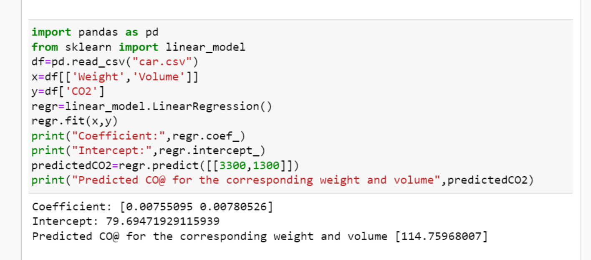

# Implementation of Multivariate Linear Regression
## Aim
To write a python program to implement multivariate linear regression and predict the output.
## Equipment’s required:
1.	Hardware – PCs
2.	Anaconda – Python 3.7 Installation / Moodle-Code Runner
## Algorithm:
### Step1
Recieve the input.

### Step2
Write the code for multivariate linear regression.

### Step3
Implement multivariate linear regression.

### Step4
Execute the code.

### Step5
Verify the result.

## Program:
```python
'''
Developed by:Vishnupriya R
Reference number:22006962
'''
import pandas as pd
from sklearn import linear_model
df=pd.read_csv("car.csv")
x=df[['Weight','Volume']]
y=df['CO2']
regr=linear_model.LinearRegression()
regr.fit(x,y)
print("Coefficient:",regr.coef_)
print("Intercept:",regr.intercept_)
predictedC02=regr.predict([[3300,1300]])
print("Predicted CO@ for the corressponding weight and volume",predictedCO2)

```
## Output:


## Result
Thus the multivariate linear regression is implemented and predicted the output using python program.